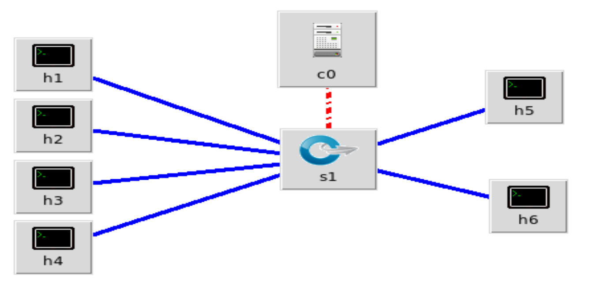
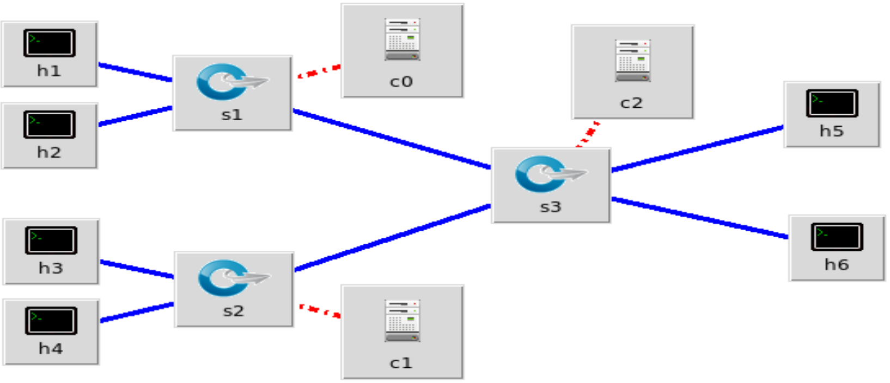
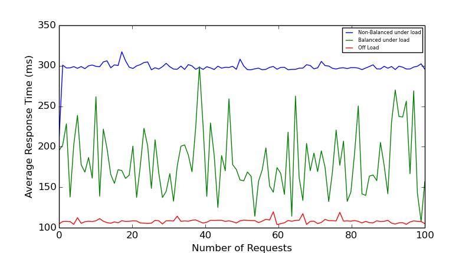
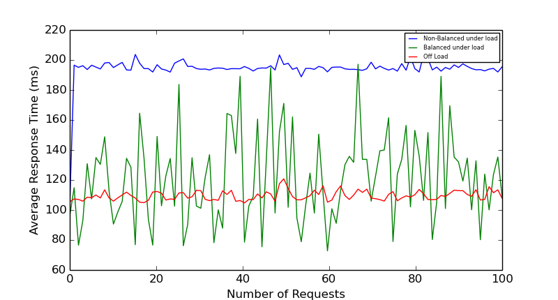
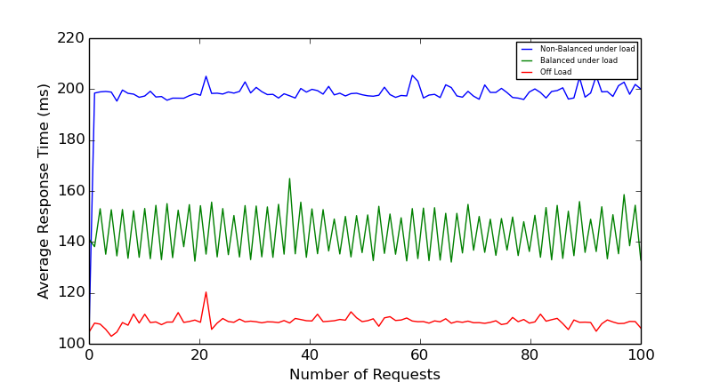
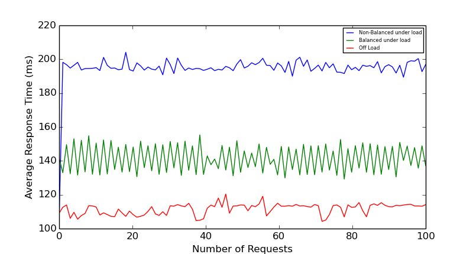

# Mininet SDNs and load balancing

### Introduction
[Mininet](http://mininet.org/) creates a virtualized realistic Software defined Network and provides a feature rich Python API. This projects/repository deals with developing, testing and experimenting with emulated networks using Mininet. As of now two topologies Tree and Star having a total of 6 Nodes are created with different parameters to simulate actual networks. On these two topologies load testing and load balancing was simulated using python scripting. I apologize as the implementation as of now is not as per industry standards on many grounds but I look to improve that in the future.

 

### Topologies
For the task of creation and development of the topologies the `Mini Edit` tool was used. It is python program that helps in creation of Network Topologies (also included in the repo `miniedit.py`). The following topologies where finally created with this tool each having 6 Nodes (hosts). For the purpose of service and client simulation, 2 Nodes out of 6 are used as server and the remaining 4 as clients.

 

#### Star Topology

 

#### Tree Topology

 

### Host/Node Programs
Each host or node in this emulated network runs a python script. This python script describes the nature of the node. We have a client and server script that can be used to emulate a client making 100 requests repeatably to a simple HTTP server respectively. These scripts are configured to work with the topologies mentioned above (assuming that the service is present at 10.0.0.4). Additionally the client scripts are configured to log the response time from the server which will be used later to visualize results.

 

### Tests
 Their are three kind of tests that are run on both the topologies (tree and star) which are `base`, `load` and `bal`. The `base` test is basically a single client making request to a single server, this would act as the baseline for the rest of the two tests. The `load` test involves three clients making requests to the service ip which then redirects them to the actual single server, doing this we retrieve the latency being caused by the single server architecture in handling multiple requests. Last not the least `bal` test involves three client making requests to the service ip which then redirects them to server, out off 2 total servers available, by doing so we are able to determine how the response time reduces on addition of another server.

  

### Load balance
We are using two algorithms for load balancing in the `bal` test. One is a simple Random algorithm and the other a bit more complex Round Robin. Though the implementation of service load balancing can be improved by the better use of controllers, better programming and knowledge of Networks (I am a newbie in this domain on Software Development), we are still able to get convincing results.

 

### Results
Though I am using a simple redirect as a mean to load balance and escape from the complex logic required to program controllers (maybe in the future I'll update the project to use controllers efficiently) we still see promising out comes. The results show why load balancing is so important in the industry applications involving high traffic, high availability and low latency, as just adding one more server in the equation and providing load balancing (using algorithms like Round Robin) improves the response time by roughly 60% even in our trivial implementation.

| Algorithm | Star Topology | Tree Topology |
| --- | --- | --- |
| Random |  |  |
| Round Robin |  |  |

Our results also show that using Random approach which does not provide any context to the service about the load on servers can lead to inconsistent response times, whereas Round Robin which at least promises to equally distribute requests among servers seems more promising.

 

### Future Work
In the future I am looking to improve the quality of my existing work (using controllers more efficiently) including improving tests and configurations for the project. I also look to experiment with dynamic server allocation on increasing server load and sleeping servers when load reduces and other dynamic techniques that may help in increasing the server utilization, reduce the costs for providing services, reduce server response time and reduce overall latency in the client - server architecture and cloud applications.

 

##### Made with ❤️

